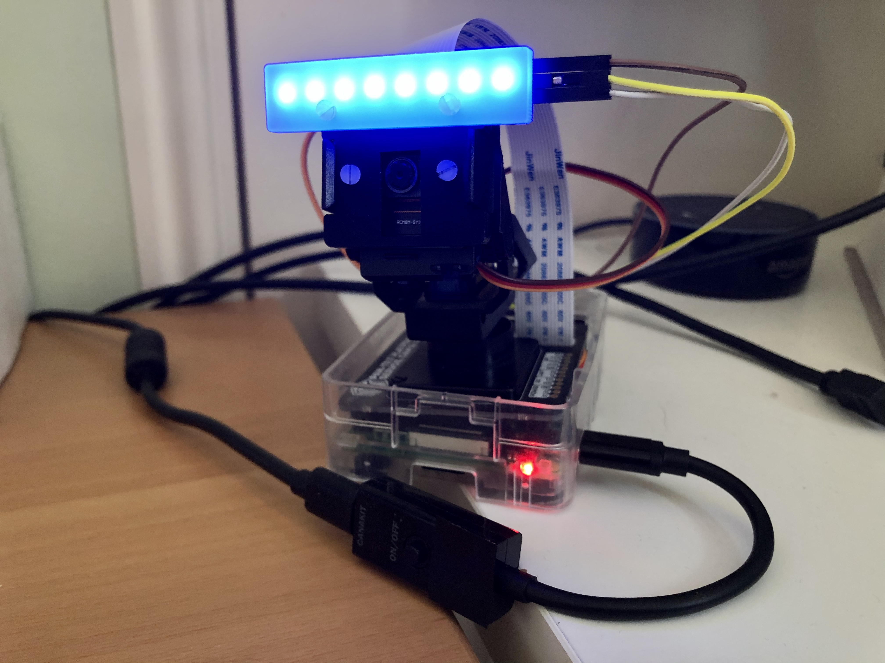

# vr-sentry [WIP]

Virtual Reality Sentry by Nathan Robinson

- `app/` - A demo application that provides a live feed and camera controls.
- `images/` - Pictures of the camera and screenshots of the app.
- `tutorials/` - Documentation for setting up a Raspberry Pi and the demo application.
