> If you already have a Raspberry Pi running the latest Raspberry Pi OS with support enabled for the camera and I2C, please skip to [Step 7](#step7).

# Step 1: Download Raspberry Pi OS

Before we begin installing the necessary tools to get the sentry server running on the Raspberry Pi, we need to install an operating system on the microSD card that we wish to boot the Pi from. For this tutorial, we will be using **Raspberry Pi OS Lite** since we won't require a Desktop Environment.

Open the following page in your browser and click the download button for **Raspberry Pi OS Lite**: https://www.raspberrypi.org/software/operating-systems/

> At the time of writing [this image was used.](https://downloads.raspberrypi.org/raspios_lite_armhf/images/raspios_lite_armhf-2021-01-12/2021-01-11-raspios-buster-armhf-lite.zip)

After the download of the .zip completes, extract the contents to a suitable location. You will end up with a disk image named something like `2021-01-11-raspios-buster-armhf-lite.img`.

# Step 2: Install Raspberry Pi OS

Now that we have the Raspberry Pi OS image we need to flash it to the microSD card. There are several ways of doing this, ranging from the `dd` command to numerous graphical utilities.

For this tutorial, we'll use [balena Etcher](https://www.balena.io/etcher/) because it works on Windows, Mac, and Linux, but if you have a preferred tool, please feel free to use it instead.

Upon opening Etcher, you will see the following window:

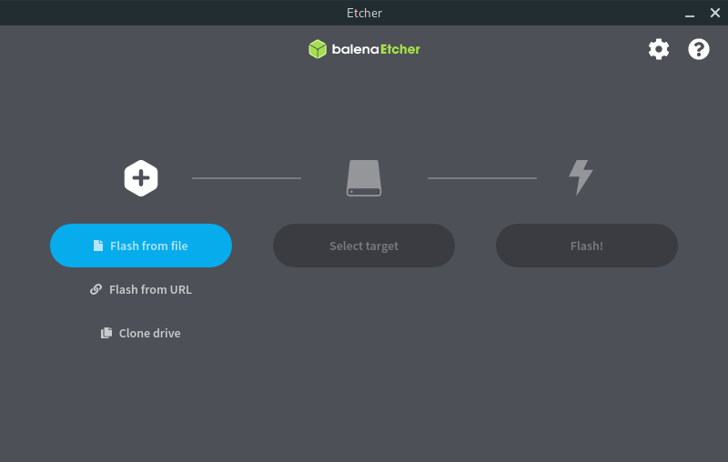

Click the `Flash from file` button and select the `.img` you extracted from the `.zip` that you downloaded.

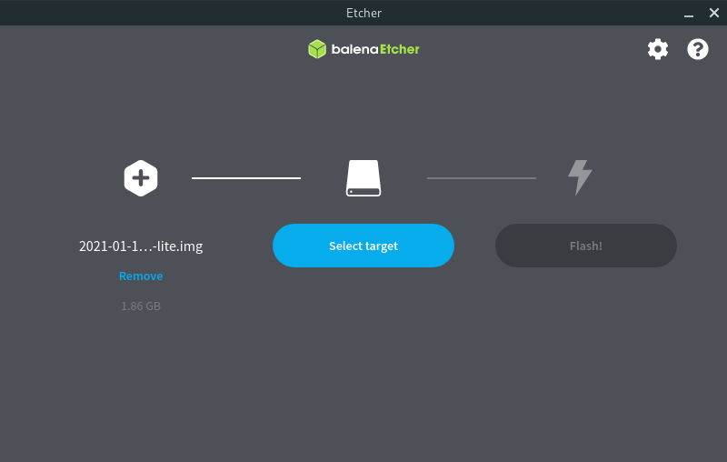

Insert your microSD card into the reader and connect the reader to your computer. Next, click the `Select target` button.

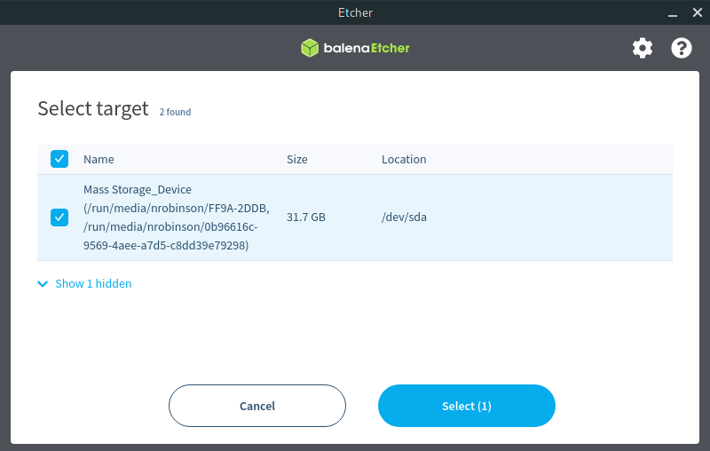

Select the drive that is your microSD card. Do not select any other drives!

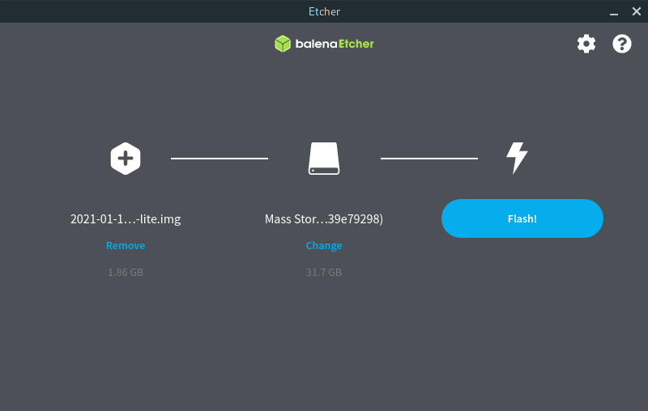

Now that you have selected the image and the drive, click the `Flash!` button to flash the Raspberry Pi OS image to your microSD card.

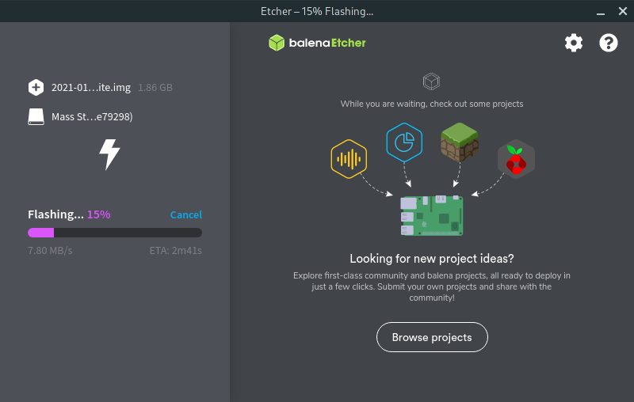

It will take a few minutes for Etcher to flash and validate the image.

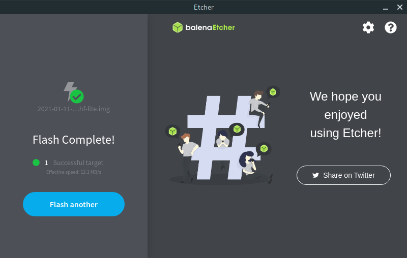

You can quit Etcher after it finishes flashing the image.

# Step 3: Headless mode customizations

When using the Raspberry Pi you can choose to connect a mouse, keyboard, and HDMI display, but for this tutorial we will use the Raspberry Pi in headless mode, logging in remotely with SSH to control the Pi.

## Step 3a: Enable SSH

To enable SSH on the Raspberry Pi when it boots, we must create an empty text file named `ssh` on the boot partition of the microSD card.

* Open the `boot` partition of the microSD card in your file manager.
* Create an empty file named `ssh`.

## Step 3b: Enable Wi-Fi (Optional)

Next, we will enable Wi-Fi on the Raspberry Pi. If you will be using Ethernet you can skip this step.

To enable Wi-Fi we must create another text file on the boot partition:


* Open the `boot` partition of the microSD card in your file manager.
* Create a text file called `wpa_supplicant.conf`.
* In `wpa_supplicant.conf` paste in the following configuration:

```conf
ctrl_interface=DIR=/var/run/wpa_supplicant GROUP=netdev
update_config=1
country=US

network={
	ssid="YOUR_SSID"
	psk="YOUR_PASSWORD"
}
```

* Change `YOUR_SSID` and `YOUR_PASSWORD` to the SSID and password of your Wi-Fi network.

# Step 4: Boot and connect to the Raspberry Pi

Now that we have installed the OS and enabled SSH and Wi-Fi, it's time to power on and connect to the Pi.

* Ensure that the Raspberry Pi camera is properly connected using the ribbon cable.
* Insert the microSD card, and connect Ethernet and a monitor if you wish.
* Connect the USB-C power cable to the Pi.

The Pi should begin booting. You'll see some red and green flashes from the onboard LEDs and lots of text fly if you've attached a monitor.

## Step 4a: Finding the IP address

It can be a challenge to find the IP address of your Raspberry Pi.

Luckily there are a few ways to do this:

* The first is to boot the Pi with a monitor attached. Towards the end of the boot process, a line starting with `My IP address is` will be printed, listing the IPv4 and IPv6 addresses of the Pi. 

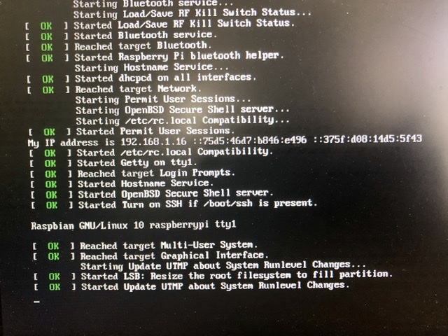

> On my Raspberry Pi the line begins with:
>
> `My IP address is 192.168.1.16`

* The second way is to take advantage of the `raspberrypi.local` mDNS hostname the Pi provides. In most circumstances, if there is only one Raspberry Pi on your network, `raspberrypi.local` should resolve to your Pi in SSH, HTTP, and other protocols.

> A more advanced way to find the IP address would be to use [arp-scan](https://github.com/royhills/arp-scan), a powerful command-line tool for Linux and macOS that allows you to discover devices on your network and identify the manufacturer based on the MAC address. The following command uses arp-scan to discover devices on your local network and filter the results with grep.


```bash
$ sudo arp-scan -l | grep 'Raspberry Pi'

192.168.1.7	    b8:27:eb:57:9b:58	Raspberry Pi Foundation
192.168.1.7	    b8:27:eb:57:9b:58	Raspberry Pi Foundation (DUP: 2)
192.168.1.48	dc:a6:32:01:04:d4	Raspberry Pi Trading Ltd
192.168.1.48	dc:a6:32:01:04:d4	Raspberry Pi Trading Ltd (DUP: 2)
192.168.1.16	dc:a6:32:01:04:d3	Raspberry Pi Trading Ltd
192.168.1.38	b8:27:eb:59:20:f3	Raspberry Pi Foundation
192.168.1.48	dc:a6:32:01:04:d3	Raspberry Pi Trading Ltd (DUP: 3)
```

> Newer Raspberry Pi's will be identified as `Raspberry Pi Trading Ltd`, while older Pi's will be identified as `Raspberry Pi Foundation`.

## Step 4b: Connecting with SSH

Now that the Raspberry Pi is connected to our network and we know the IP address and enabled the SSH server, we'll remotely log into the Pi using SSH to further configure the Pi and set up the webcam server.

On Linux, macOS, and Windows, the `ssh` command is available in your terminal emulator. 

* On Windows open either command prompt or Powershell.
* On macOS open Terminal.app
* On Linux you probably already know how to open your preferred terminal emulator.

Enter the following to connect to your Pi using SSH:

```bash
ssh pi@raspberrypi.local
```

* You will likely be prompted to accept the fingerprint of the host. Enter `yes` to continue connecting.
* When asked for the password of the `pi` user, enter the default password of `raspberry` and press Enter. (As you type the password the characters will not be printed to the terminal.)

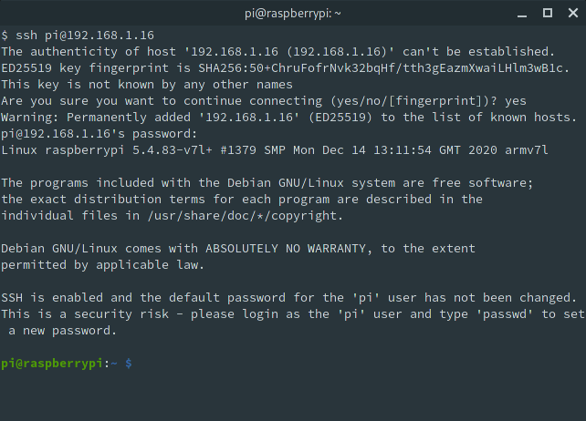


> If `raspberrypi.local` isn't working, use the IP address you obtained in Step 4a.
>
> In my case: `ssh pi@192.168.1.16`

# Step 5: Configure the Raspberry Pi and enable the camera

Now that we have the Pi up and running it's time to begin using it. We first need to configure some system settings and enable the Raspberry Pi camera.

Enter the following to open the configuration tool:

```bash
sudo raspi-config
```

You will be presented with the following menu:

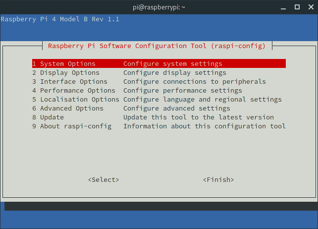

## Changing Locale

Using the arrow keys, navigate down to `Localisation Options` and press Enter:

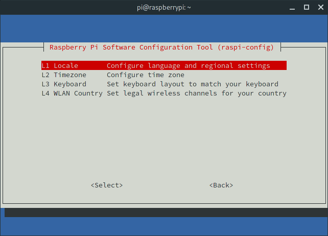

Select `Locale` and press Enter.

Navigate down to the `en_GB.UTF-8 UTF-8` option and press Space to disable it:


Navigate down to the `en_US.UTF-8 UTF-8` option and press Space to enable it:

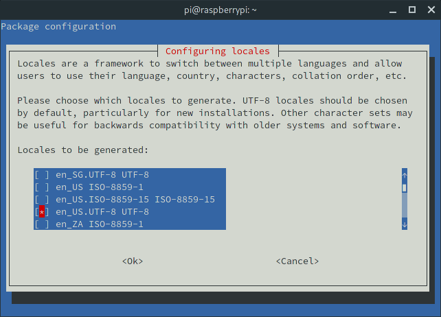

Press Enter to apply the locale.

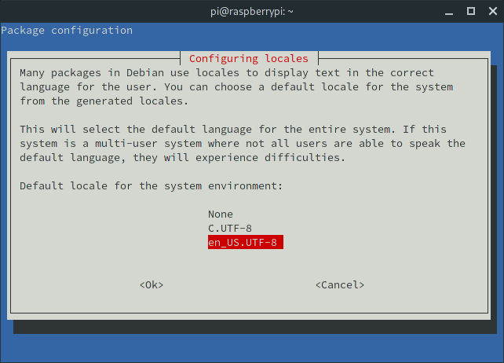

Select `en_US.UTF-8` as the default locale and press Enter.

After the locale is generated, you will be brought back to the initial menu.

## Changing Timezone

Select `Localisation Options` again, and choose the `Timezone` option:

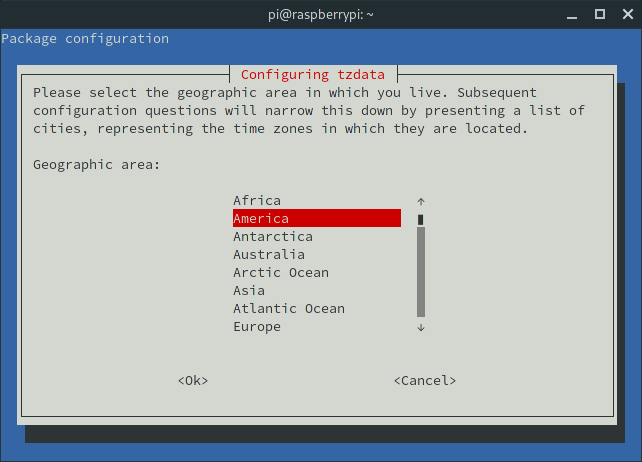

My timezone is America/New York so that is what I selected.

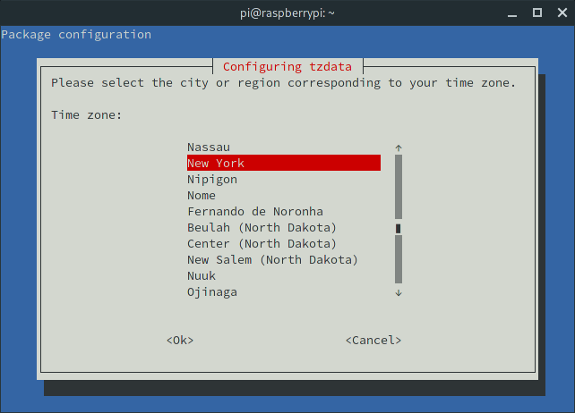

## Changing the password

Under `System Options` select the `Password` option:

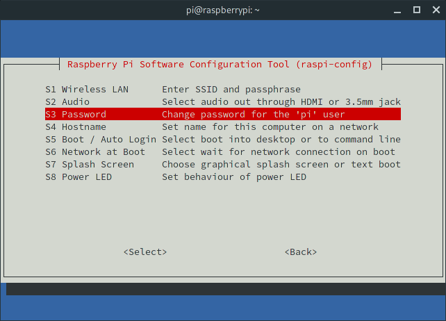

You will be prompted to enter and confirm a new password.

## Enabling I2C support

Under `Interface Options` select the `I2C` option:

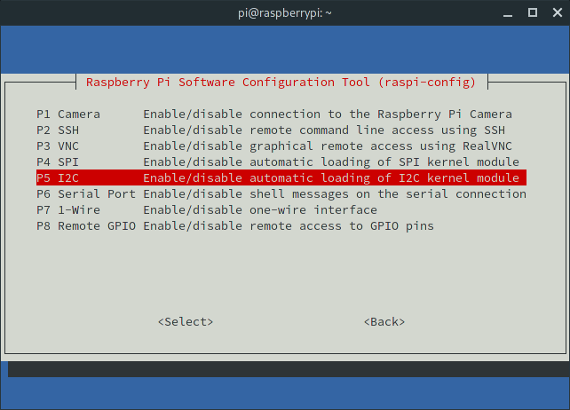

Select `Yes` to enable I2C.


## Enabling the camera

Under `Interface Options` select the `Camera` option:

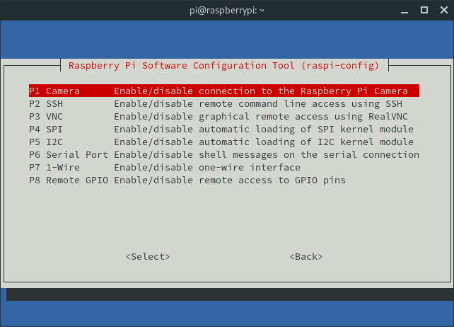

Select `Yes` to enable the camera.

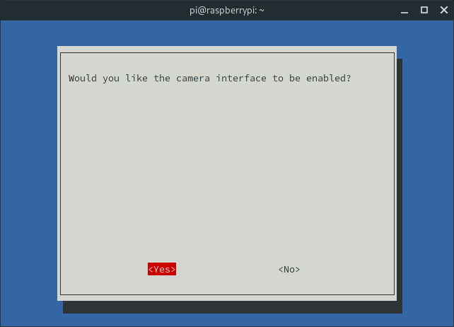

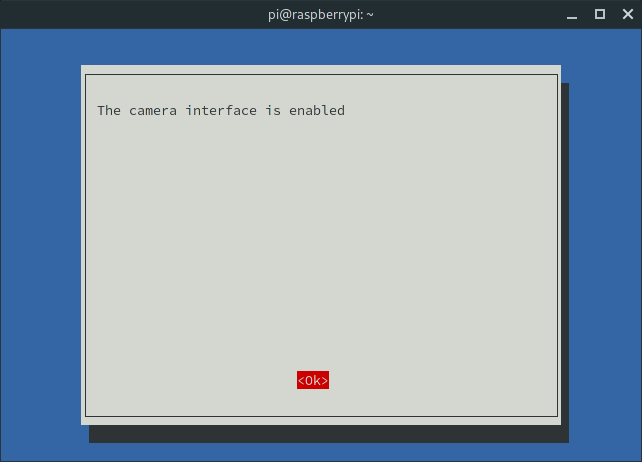


After changing the locale, timezone, password, and enabling the camera, select `Finish` in the menu. When asked to reboot select `No`.

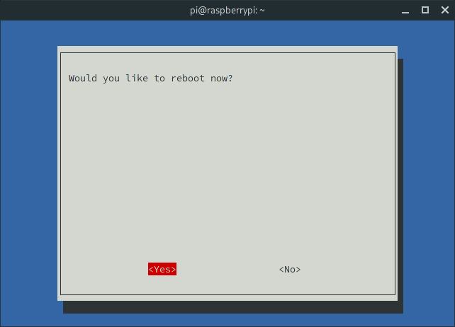

# Step 6: Install updates

Now that we have configured the Raspberry Pi and enabled the camera, it's time to install the necessary packages to provide the camera server.

Install any available updates with the following:

```bash
sudo apt update && sudo apt upgrade
```

When asked to continue enter `y`:

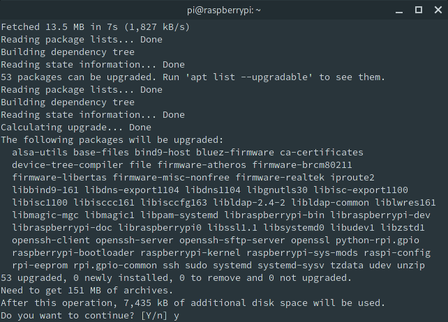

It will take a few minutes for the updates to download and apply. Reboot after the updates finish.

```
sudo reboot
```

# Step 7: Installing UV4L{#step7}

Log back into the Pi over SSH using the new password you created.

Accept the repo signing key:
```
curl https://www.linux-projects.org/listing/uv4l_repo/lpkey.asc | sudo apt-key add -
```

Add the repo to your apt sources:

```
echo "deb https://www.linux-projects.org/listing/uv4l_repo/raspbian/stretch stretch main" \
| sudo tee -a /etc/apt/sources.list
```

Install the packages:

```
sudo apt update
sudo apt install uv4l uv4l-raspicam uv4l-raspicam-extras uv4l-webrtc
```

## Reducing resolution and framerate

By default, UV4L streams at 1920x1080 30FPS, which is an incredibly high data rate.

Edit the UV4L configuration file:

```
sudo nano /etc/uv4l/uv4l-raspicam.conf
```

Go down to the `raspicam driver options` section:

```
##################################
# raspicam driver options
##################################

encoding = mjpeg
# width = 640
# height = 480
framerate = 30
#custom-sensor-config = 2
```

Change the the width, height and framerate values to something more reasonable:

```
width = 1280
height = 720
framerate = 20
```

## Changing the port

Next, go down to the `streaming server options` section:

```
#################################
# streaming server options
#################################

### path to a separate config file that will be parsed by the streaming server
### module directly when it's loaded,
### in which you are allowed to specify all the streaming server options
### listed below in the short form "option=value" instead of the longer
### "--server-option = --option=value" form that you must use
### in this configuration file.
#server-config-file = #path

# server-option = --port=8080
# server-option = --bind-host-address=localhost
# server-option = --md5-passwords=no
# server-option = --user-password=myp4ssw0rd
# server-option = --admin-password=myp4ssw0rd
### To enable 'config' user authentication
# server-option = --config-password=myp4ssw0rd
```

Uncomment the `server-option = --port` line and change the port to 80:

```
server-option = --port=80
```

To save and close the editor press: Ctrl-X to Exit, Y to save changes, and Enter to confirm.

### Reloading the server

Reload the UV4L server with the following:

```
sudo systemctl restart uv4l_raspicam.service
```

### Verifying the stream is working

In your preferred browser open the following URL:

```
http://raspberrypi.local/stream/video.mjpeg
```

You should see the live feed from your Raspberry Pi camera!

### Flipping the camera feed

Depending on how you positioned the camera, you may need to flip the video orientation:

Open the UV4L configuration file again:

```
sudo nano /etc/uv4l/uv4l-raspicam.conf
```

Go down to the `image settings options` section:

```
### image settings options:
# sharpness = 0
# contrast = 0
# brightness = 50
# saturation = 0
# iso = 400
# vstab = yes
# ev = 0
# exposure = auto
# flicker = off
# awb = auto
# imgfx = none
# metering = average
# rotation = 0
# hflip = no
# vflip = no
# shutter-speed = 0
```

Uncomment and set both `hflip` and `vflip` to `yes`:
```
hflip = yes
vflip = yes
```

To save and close the editor press: Ctrl-X to Exit, Y to save changes, and Enter to confirm.

After reloading the server with: `sudo systemctl restart uv4l_raspicam.service` you should see that stream now has a proper first-person view.

# Step 8: Running the demo application

The demo application provides an interface to control the servos and lights on the Pan-Tilt HAT


Install the necessary dependencies:

```
sudo apt install git python3-pantilthat python3-smbus python3-flask
```

Download and run the Python application:

```
git clone https://github.com/nrobinson2000/vr-sentry
cd vr-sentry/app
python3 app.py
```

Now if you open the following URL in your browser you should be presented with the demo application:

```
http://raspberrypi.local:8080
```

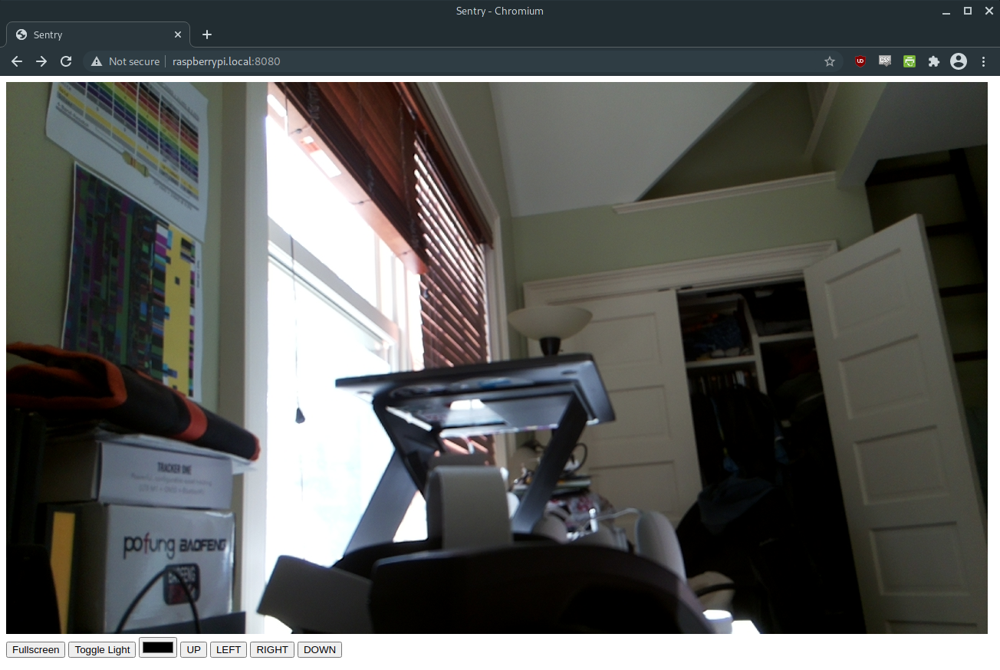

# Conclusion

That's it for this tutorial. In the next tutorial, we'll create a Unity application that will provide us with an interface to view and control the camera feed from within the Oculus Quest 2.

In the meantime, you should be able to use the demo application in the Oculus browser. If you click the `Fullscreen` button the video feed will expand to fill your perspective. You can click on the left and right sides of the feed to rotate the camera.

>If the Quest cannot resolve `raspberrypi.local` try the IP address of the Pi.