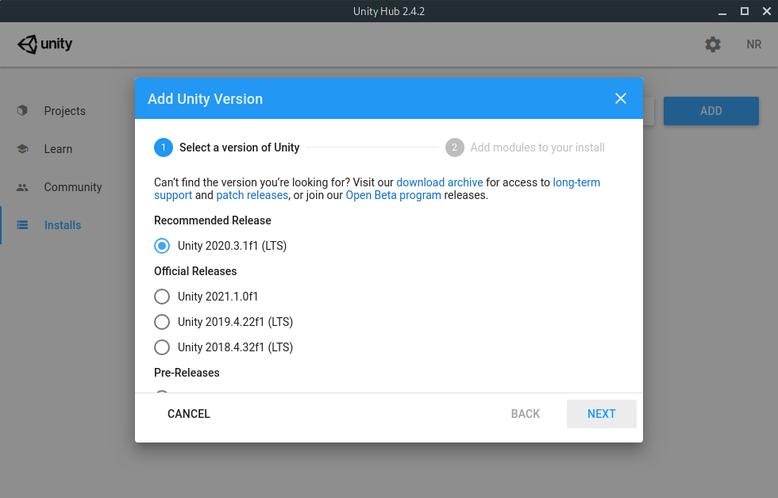
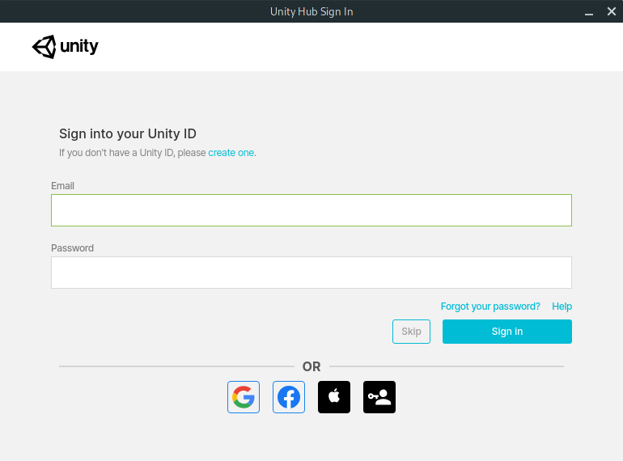
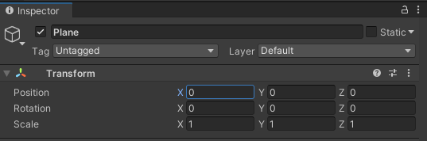

>This tutorial assumes that you have already set up your Oculus Quest and have the Oculus mobile application on your iOS or Android smartphone. If you require assistance please refer to this Oculus support page: https://support.oculus.com/795778631158860

# Step 1: Enable Developer mode

Before we can begin developing a Unity application for the Oculus Quest we must register as an Oculus developer. Open the following page in your browser and log into your Oculus account: https://developer.oculus.com/manage/organizations/create/

After logging in, you should see this page:


Choose a name for your organization. Since we won't be publishing any applications to the Oculus Store, the name doesn't matter. I'll be using `VRTutorial`.


Agree to the terms and click the `Submit` button. You shouldn't need to touch this page again.

Open the Oculus app on your smartphone.
* Tap the `Settings` tab on the bottom right.
* In the Settings menu, tap your Oculus Quest 2 to connect to the headset.


Tap `More Settings` and then select `Developer Mode`.


In the Developer Settings menu, tap the slider to enable Developer Mode on your Oculus Quest 2.


If all goes well and the slider becomes activated, you have successfully enabled developer mode. Reboot your Quest 2 for the change to take effect.

> With the recent Oculus acquisition by Facebook, the process for enabling developer mode became slightly more tedious. For the app to enable developer mode, you must register as a developer and have a valid payment method on your Oculus account, much to the annoyance of thousands of users. You can add a payment method here: https://secure.oculus.com/my/payment-methods/

# Step 2: Install Unity Hub

We'll be using the Unity game engine to develop our application for the Oculus Quest 2.

To manage our installations of Unity we'll use an application called Unity Hub.

Open the following page in your browser and click the green `Download Unity Hub` button to download the Unity Hub installer: https://unity3d.com/get-unity/download

* On Windows, run `UnityHubSetup.exe`, agreeing to the license, and selecting the default Destination Folder. When the installation completes, leave the `Run Unity Hub` box unchecked.

* On Mac, open `UnityHubSetup.dmg`, agree to the license and then drag Unity Hub to your Applications folder.

___

On Manjaro Linux and other Arch-based Linux distributions it is preferable to install Unity Hub, mono, the .NET SDK, JetBrains Rider, and Android Studio using the [Arch User Repository](https://aur.archlinux.org/):

```bash
$ yay -S unityhub dotnet-sdk mono rider android-studio
```

# Step 3: Install the Unity Editor

Now that we have Unity Hub we need to install a Unity version. Select `Installs` from the sidebar and click the `ADD` button to install a Unity version.


Select a version of Unity to install. At the time of writing `2020.3.1f1` was used:



Click `NEXT` to continue. When asked to `Add modules to your install` ensure that `Android Build Support` is selected:


> On Windows, there will be an option for `Microsoft Visual Studio Community`. You should select it if you are not going to use an alternative IDE like [JetBrains Rider.](https://www.jetbrains.com/rider/)

Click `NEXT`, agree to the Android SDK and NDK license, and click `DONE`.


The Unity version should begin installing. It can take several minutes depending on your internet speed. Once the installation finishes you should see the Android logo present:


If this is your first time using Unity, you will need to sign in or create a Unity account:


<!--  -->

# Step 4: Create a new Unity project

In Unity Hub, select `Projects` in the sidebar and click the `NEW` button. Create a project using the `3D` template:


After Unity initializes the project and import the assets you will be presented with the Unity Editor window:


# Step 5: Import Oculus Integration

Open the following link in your browser: https://assetstore.unity.com/packages/tools/integration/oculus-integration-82022


Click the `Add to My Assets` button and sign into your Unity account.

In the Unity Editor open the `Package Manager` window by clicking Window > Package Manager:


Open the `Packages: In Project` menu and select `My Assets`. You should see `Oculus Integration` in the list. If you don't, click the refresh button at the bottom of the window.


Click the `Import` button. When the window pops up listing the files that will be added, leave everything checked, and click `Import`.


After a few minutes of importing, you may be asked to update `OVRPlugin`. Click `Yes`.


Click `Restart`.


Click `Upgrade`.


Click `Restart`.


The Unity Editor will then restart.

<!--  -->

# Step 6: Configure for Quest

Open the `Build Settings` window with File > Build Settings...


* Click `Add Open Scenes`.

* Select the `Android` platform.

* Set `Texture Compression` to `ASTC`


Click `Player Settings`


Change the `Company Name` to something unique. For this tutorial I'll use `VRTutorial`.

## XR Plugin Management

Select `XR Plugin Management` from the sidebar:


Click the `Install XR Plugin Management` button.


* Check the `Oculus` box and after the assets initialize, ensure the `Initialize XR on Startup` box is checked.
* Close the `Project Settings` window.
* Click the `Switch Platform` button.

This will take around 10 minutes to apply as all of the assets will have to be regenerated for the Android platform.

# Step 7: Creating the Scene

Now that we have finally set up the Unity project to build for the Quest 2, it's time to fill the scene with our objects.


Here is a preview of the final product. We will be creating a large screen to view the camera stream and some control panels to pause/play the stream, move the camera, and toggle the light.


>I've moved my `Hierarchy` above the `Inspector` so that I have more room for the `Scene` view.

___

The first thing we need to do is remove the `Main Camera` from the Hierarchy. Right-click it and click `Delete`.


## Step 7a: Creating a Plane and the VR player

Next, we will create a Plane for the player to stand on. Right-click in the Hierarchy and select `3D Object` > `Plane`.


With the Plane selected in the Hierarchy, zero out the position of the Plane's Transform by setting X, Y, and Z to zero. The Plane should be centered in the scene with the Directional Light above it.




Next, we need to add the `OVRPlayerController` prefab to the scene. This object allows us to interact with the scene on the Oculus Quest 2.


In the Project panel, Select the `Assets > Oculus > VR > Prefabs` folder and drag the `OVRPlayerController` prefab into the Hierarchy. Change the `OVRPlayerController` Transform position to `(0, 1, -2.6)`.

Next, we will add controller prefabs to the `OVRPlayerController` so that we can see our controllers in virtual space.

Fully expand the `OVRPlayerController` to reveal the `LeftControllerAnchor` and `RightControllerAnchor` objects.


From the Project panel, drag a `OVRControllerPrefab` onto `LeftControllerAnchor` and `RightControllerAnchor`.


For each `OVRControllerPrefab` change the `Controller` property to `Touch`. (`L Touch` for the left, `R Touch` for the right.)


## Step 7b: Testing the build process{#step7b}

Before we go too far developing the scene it's a good idea to confirm that we can build and deploy the application to the Quest 2.

Connect your Quest 2 to your PC using a USB-C cable and put it on. If this is your first time developing for the Quest, you will need to accept any popups about USB debugging that are displayed inside the Quest.


Open `Build Settings` again and select `Run Device`. Select your Quest 2 if it appears in the list. If it does not, click the refresh button and try again.

Once you have selected your `Run Device` click `Build And Run`. You will be asked for a location and name to save the `.apk` file. I recommend creating a new folder in the Unity project called `build` and saving the `.apk` there.

Unity will then build the project and deploy the application to the Quest 2. Building the project for the first time can take a few minutes.


Once the application deploys, put on your headset. You will find yourself standing on the plane in the scene. You can move around the plane with the left joystick and rotate your view with the right joystick.

## Step 7c: Adding a Canvas to the scene

We will now add canvas to the scene which we will use to view the stream from the camera. Right-click in the Hierarchy and select `UI > Canvas`.


* In the Inspector, change the Canvas `Render Mode` to `World Space` and drag the `CenterEyeAnchor` from `TrackingSpace` into the `Event Camera` option.

* For the `Rect Transform`, set the position to `(0, 2.2, 3.2)` and set the width to `1280` and height to `720`. Set the scale to `0.005` for X, Y, and Z.

Next, create a Raw Image under the Canvas. We will use this Raw Image to display the frames streamed from the Raspberry Pi camera. Right-click on the Canvas and select `UI > Raw Image`.

* In the Inspector, change the Raw Image `Rect Transform` width and height to 1280x720 to match the Canvas.


## Step 7d: Adding scripts to stream video

Now that we have the Canvas with the Raw Image, we will create some scripts containing C# code that will stream JPEG frames from the Raspberry Pi camera and display them on the Raw Image.

In the Project panel, create the `Scripts` folder by right-clicking on `Assets` and selecting `Create > Folder`. Name the folder `Scripts`.


In the `Scripts` folder, create two scripts by right-clicking and selecting `Create > C# Script`.


Name one script `VideoStream` and the other `CameraRequest`.

Double click both of the scripts to open them with the default IDE. Visual Studio, Rider, or Visual Studio Code should open.


For `VideoStream.cs` [copy and paste this code](https://raw.githubusercontent.com/nrobinson2000/unity-vr-sentry/master/Assets/Scripts/VideoStream.cs) into the file, replacing the default contents. For `CameraRequest.cs` [copy and paste this code](https://raw.githubusercontent.com/nrobinson2000/unity-vr-sentry/master/Assets/Scripts/CameraRequest.cs) into the file, replacing the default contents.

In `VideoStream.cs`, change the `camUrl` variable to point to the URL of your camera stream. The `.local` domain might not work, so using the IP address is recommended.

Because my Raspberry Pi IP address is `192.168.1.16`, I would use the following:

```csharp
private string camUrl = "http://192.168.1.16/stream/video.mjpeg";
```

After making this change, go back to the Unity window. Unity will take a second to reload the scripts.
___

Feel free to read through the code if you are interested. Most of the work happens in the `CameraRequest.ReceiveData` method where JPEG frames are extracted from incoming camera data and placed into the `currentFrame` buffer.

## Step 7e: Using the scripts

Now that we have created the scripts we need to attach them to GameObject so they can run. In the Hierarchy, right-click and select `Create Empty`. Call the object `Manager`.


Drag the `VideoStream` script onto `Manager` and then drag the RawImage under the Canvas onto the `Screen` property of the `Video Stream (Script)` component.


For a quick preview, click the play button in the upper center of the Unity window. You should see a live camera feed displayed on the Raw Image. Click the play button again to stop the preview.

# Step 8: Running the application

Now that we have created the scene and previewed it in the Unity editor it's time to deploy the application to your Quest 2. If you tested the build process in [Step 7b](#step7b) you should simply press CTRL-B again to `Build And Run` the project. (You can also click `File > Build And Run`.)

After Unity builds and deploys the application to your Quest 2, put on your headset.


You should see the camera feed streaming onto the canvas. If are experiencing input lag or movement stuttering don't worry, we will address this later.

# Step 9: Adding camera controls

Next, we will add a user interface to provide controls for stream playback, camera movement, and lighting. The stream playback controls will be used to stop/resume the live feed and the other controls will use the API we developed in the previous tutorial.

## Importing the canvas background

We will use the following image as a background for the control panels:


[You can download the image here.](https://raw.githubusercontent.com/nrobinson2000/unity-vr-sentry/master/Assets/Textures/ui-canvas.jpg)

In the Project panel, create a new folder called `Textures` inside the `Assets` folder. After downloading the image drag it into the `Textures` folder.

## Importing the Camera Control script

In the `Assets > Scripts` folder create a `C# Script` called `CameraControl` and [copy and paste this code](https://raw.githubusercontent.com/nrobinson2000/unity-vr-sentry/master/Assets/Scripts/CameraControl.cs) into the file in your IDE.

Be sure to update the `apiUrl` variable to contain the IP address of your Raspberry Pi:

```csharp
private string apiUrl = "http://192.168.1.16:8080/api";
```

After editing the file drag the `CameraControl` script onto the `Manager` object.

> The Flask server needs to be running on the Raspberry Pi to listen for incoming requests to move the camera or toggle the lights. I recommend starting the demo application within `GNU Screen` and detaching from the session so that the server will continue to run after you close SSH.

## Creating the Stream Control panel

Create a new Canvas in the Hierarchy. (`UI > Canvas`) Name the canvas `StreamControls`. Set the `Render Mode` to `World Space` with `CenterEyeAnchor` as the `Event Camera`.

* Set the position to `(-2, 0.5, 1.3)`, the width and height to `300x200`, and the scale to `0.005` on the X, Y, and Z.
* Set the rotation to `40` on the X axis.


Create a Raw Image under the `StreamControls` canvas and name it `Background`. (`UI > Raw Image`)

* Set the width and height to `300x200` to match the canvas, and drag the `ui-image` texture onto the Raw Image `Texture` property.


Create a Text object under the `StreamControls` canvas and name it `Title`. (`UI > Text`)

* Set the Y position to `55`, the text to `Stream Controls`, the Font Size to `20`, the Alignment to center, and the color to white.

In the `StreamControl` canvas, create two buttons called `Play` and `Pause`.

* Set the height and width of both buttons to `70x30`.
* For the Play button set the position to `(-60, 0, 0)`,
* For the Pause button set the position to `(60, 0, 0)`.
* For the Text objects inside the two buttons change the text to `Play` and `Pause`.

On each button, in the `On Click ()` section, click the plus button and drag in the `Manager` object. 

Select `VideoStream.PlayStream` for the Play button, and `VideoStream.PauseStream` for the Pause button.


## Replacing the EventSystem and adding a Laser Pointer

While the Play and Pause buttons work in the Unity preview, they won't work when the application is deployed to the Oculus Quest 2. To fix this, we can add an Event System that will work in Virtual Reality.

In the Project panel, search for the `UIHelpers` prefab and drag it into the Hierarchy.

* Set the original `EventSystem` to inactive by unchecking the first box in the inspector. It should become grayed out in the Hierarchy. (You can also delete the original EventSystem at this point.)


In the `EventSystem` under `UIHelpers` change the `Joy Pad Click Button` to `Primary Index Trigger` and `Secondary Index Trigger` from the list.

In the `LaserPointer` object under `UIHelpers` check the box to enable the `Line Renderer` this will allow us to easily select buttons.

In the `Stream Controls` canvas remove the `Graphic Raycaster` component. Click the three vertical dots on the right and select `Remove Component`.


Click the `Add Component` button at the bottom of the Inspector. Search and select `OVR Raycaster`. Drag the `LaserPointer` from `UIHelpers` into the Pointer property.


You should additionally remove the `Graphic Raycaster` from the live feed canvas since removing it will greatly improve performance.

## Testing the user interface

Build and Run the application. Once the application deploys, you should see the live feed and the control panel. Clicking the Pause button will stop the stream and clicking the Play button will resume the stream.


## Creating additional panels

Next, we'll create two more control panels for moving the camera and toggling the light. Create two copies of the `StreamControls` canvas. Place one at `(0, 0.5, 1.3)` and the other at `(2, 0.5, 1.3)`. Call one of the canvases `CameraControls` and the other `LightControls`.

* In the `LightControls` canvas change the text in the Title object to `Light Controls`.
* Delete the Pause button from `LightControls` and rename the Play button to `Toggle`, changing the text to `TOGGLE`.
* Set the position of the Toggle button to `(0, 10, 0)`.
* In the `On Click ()` section of the Toggle button, change the callback function to `CameraControl.lightToggle`.


* In the `CameraControls` canvas change the text in the Title object to `Camera Controls`.
* Rename the Play button to `Left` and set the text to `LEFT`.
* In the Left button change the `On Click()` callback to `CameraControl.moveLeft`.
* Set the position of the Left button to `(-60, -10, 0)`.
* Rename the Pause button to `Right` and set the text to `RIGHT`.
* In the Right button change the `On Click()` callback to `CameraControl.moveRight`.
* Set the position of the Right button to `(60, -10, 0)`

Next, we'll create the Up and Down buttons inside `CameraControls`:

* Create two copies of the Right button, renaming them and setting the text to `Up` and `Down`.
* For the Up button, set the position to `(0, 25, 0)`.
* For the Up button change the `On Click()` callback to `CameraControl.moveUp`.
* For the Down button, set the position to `(0, -45, 0)`.
* For the Down button change the `On Click()` callback to `CameraControl.moveDown`.

You should now have three control panels with the appropriate buttons.


# Step 10: Running the complete application

Now we have the Camera and Light control panels. If we click the buttons on the Camera control panel the camera will move in the desired direction. If we click the toggle button on the Light control panel we can turn the light on and off. (The light will automatically turn off after 30 seconds server-side.)


# Step 11: Optional Performance Improvements

Now that we've built the application and tested the application you've probably noticed that the camera and controllers stutter a lot if we move while the stream is playing.

While the Oculus documentation [provides many recommendations for improving performance in Unity applications](https://developer.oculus.com/documentation/unity/unity-mobile-performance-intro/) on the Oculus Quest, only a few performance tricks will be listed here.


## Skybox

The default Unity skybox is expensive to render and not very exciting. We can switch out the default skybox to one included with the Oculus Integration package.

Open the Lighting window with `Window > Rendering > Lighting`.


In the Environment tab select `Skybox02` for the `Skybox Material`.

## Lighting Mode

In the `Scene` tab of the Lighting window change the Lighting mode to `Baked Indirect`.


## Lint tool

Open the window with `Oculus > Tools > OVR Performance Lint Tool`.

Apply any lighting-related optimizations if available. 

Additionally, on the Directional Light in the scene change the position to `(0, 7, 0)`, the rotation to `(40, 0, 0)`, and the Shadow Type to `No Shadows`.

## IL2CPP for Unity Scripting Backend

Using IL2CPP instead of Mono for the Unity Scripting Backend provides increased performance with the cost of longer build times: https://docs.unity3d.com/Manual/IL2CPP.html

Open Player Settings again with `File > Build Settings > Player Settings...`


Under `Settings for Android > Configuration` change the Scripting Backend to `IL2CPP` and select only the `ARM64` architecture.

The following images are screenshots of the Unity profiler showing performance analysis of the application using the Mono and IL2CPP scripting backends.

### Mono (79.95ms PlayerLoop)


### IL2CPP (43.65ms PlayerLoop)


When using the IL2CPP backend the runtime is greatly improved as visibly indicated by the reduced area in the `CPU Usage` section, and the greatly reduced `PlayerLoop` time when loading a frame.

## Fixed Timestep

Open the Time section in Project settings with `Edit > Project Settings... > Time`. Change the `Fixed Timestamp` value from `0.2` to `0.01111111`. This should slightly improve stuttering while moving.


## Skipping frames

After using the Unity profiler I discovered that the most expensive function call is `camTexture.LoadImage` in the `CameraRequest` script, taking around `30` milliseconds.


To reduce the time spent loading images into the texture, we can simply skip every other incoming frame. Update the `updateImage` method in `CameraRequest` with the following:

```csharp
private bool skipFrame = true;

public void updateImage()
{
    if (!frameReady) return;
    
    if (skipFrame)
    {
        frameReady = false;
        skipFrame = false;
        return;
    }
    
    if (camTexture.LoadImage(currentFrame))
    {
        screen.texture = camTexture;
        frameReady = false;
        skipFrame = true;
    }
}
```