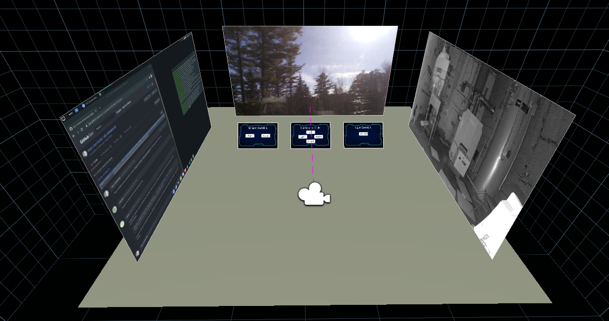
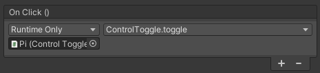

Now that we have the Raspberry Pi webcam server and Unity application it's time to make several improvements to the server and the application.

# Server

## Configure the API to start on reboot

You've probably noticed by now that we've been starting the Python server manually with `python3 app.py`, but there is a simple way to ensure that the server will be automatically restarted if the Pi is rebooted. To do this we'll create a [systemd service](https://www.freedesktop.org/software/systemd/man/systemd.service.html) that will automatically run the script when the Pi boots.

Log into the Raspberry Pi using SSH:

```bash
$ ssh pi@raspberrypi.local
```

Create the `camera_control.service` service with a text editor:

```bash
$ sudo nano /etc/systemd/system/camera_control.service
```

Enter the following:

```ini
[Unit]
Description=Python Flask API to control camera movement

[Service]
Type=simple
ExecStart=/usr/bin/python3 /home/pi/vr-sentry/app/app.py
Restart=on-abnormal

[Install]
WantedBy=multi-user.target
```

Press CTRL-X, Y to save, and ENTER to quit.

- If you cloned the `vr-sentry` repository to somewhere other than `/home/pi`, please change the file accordingly.

Enable and start the `camera_control.service` service with:

```bash
$ sudo systemctl enable --now camera_control.service
```

To check the status of the service and view the output from the script you can run:

```bash
$ sudo systemctl status camera_control.service
```

- If you get stuck in the status window, press Q to quit.

If you reboot the Pi the service will automatically be restarted for you. You will no longer need to SSH into the Pi to start the script.

## Set a password on the stream

Currently we are using UV4L over HTTP without a password on the stream. This can be a security risk as bad actors may be interested in viewing the stream. (With this implemented you would still be sending the password unencrypted. We may implement HTTPS at a later point to properly secure the server.)

Open the UV4L configuration file `/etc/uv4l/uv4l-raspicam.conf` in a text editor:

```bash
$ sudo nano /etc/uv4l/uv4l-raspicam.conf
```

Scroll down to `streaming server options` and find the `user-password` line:

```conf
# server-option = --user-password=myp4ssw0rd
```

Uncomment the line and set a password. For example:

```conf
server-option = --user-password=hello
```

Press CTRL-X, Y to save, and ENTER to quit.

For the change to take effect, restart the `uv4l_raspicam.service` service:

```bash
$ sudo systemctl restart uv4l_raspicam.service
```

To test that the password authentication is enforced, open the stream URL in your browser:

```
http://raspberrypi.local/stream/video.mjpeg
```

You should be asked to "Sign in" to the page. Enter `user` for the username, and the password you set in the file:


After clicking "Sign in", the stream should play in your browser window.

---


Before going further it is valuable to understand how setting a password impacted the HTTP request we made to open the stream. We can examine the HTTP request and response headers using `curl`.

Enter the following to request the stream with `curl`:

```bash
$ curl -vI -u user http://raspberrypi.local/stream/video.mjpeg
```

You will be prompted for a password. This is the same password that you used in the browser. When I enter the correct password I get the following:

```
$ curl -vI -u user http://raspberrypi.local/stream/video.mjpeg
Enter host password for user 'user':
*   Trying 192.168.1.51:80...
* Connected to raspberrypi.local (192.168.1.51) port 80 (#0)
* Server auth using Basic with user 'user'
> HEAD /stream/video.mjpeg HTTP/1.1
> Host: raspberrypi.local
> Authorization: Basic dXNlcjpoZWxsbw==
> User-Agent: curl/7.75.0
> Accept: */*
> 
* Mark bundle as not supporting multiuse
< HTTP/1.1 200 OK
HTTP/1.1 200 OK
< Date: Fri, 09 Apr 2021 15:25:25 GMT
Date: Fri, 09 Apr 2021 15:25:25 GMT
< Connection: Keep-Alive
Connection: Keep-Alive
< Content-Type: multipart/x-mixed-replace; boundary=Boundary
Content-Type: multipart/x-mixed-replace; boundary=Boundary

< 
* Connection #0 to host raspberrypi.local left intact

```

Notice the `> Authorization: Basic dXNlcjpoZWxsbw==` line. This means that the `Authorization` header is set with the value `Basic dXNlcjpoZWxsbw==`. The server responds with `HTTP/1.1 200 OK` meaning that the authentication was successful. Had we used `curl` without the `-I` flag, raw MJPEG data would have been streamed.

If you enter an incorrect password you'll receive a response like this:

```
HTTP/1.1 401 Unauthorized
< Date: Fri, 09 Apr 2021 15:25:19 GMT
Date: Fri, 09 Apr 2021 15:25:19 GMT
< Connection: Keep-Alive
Connection: Keep-Alive
* Authentication problem. Ignoring this.
< WWW-Authenticate: Basic realm="user or admin"
```

# Application

## Using a password in VideoStream

Now that we have enabled HTTP authentication on the backend we need to update the Unity application to comply with this or else the stream will fail to load. If you try to play the scene in the Unity editor the canvas will remain blank. In the `Assets > Scripts` folder in the Unity project, open the `VideoStream` script.

In the `PlayStream` method we created a new `UnityWebRequest`:

```csharp
webRequest = new UnityWebRequest(camUrl);
```

We need to set the `Authorization` header in this `UnityWebRequest`. We can do that with the `SetRequestHeader` method. A simple way to do this would be to use the same string produced by `curl`:

```csharp
webRequest.SetRequestHeader("Authorization", "Basic dXNlcjpoZWxsbw==");
```

Save the change and go back to the Unity Editor window. When you play the scene in the editor the stream should work again. If it doesn't, confirm that you are using the correct IP address for the Raspberry Pi in `camUrl`, as the IP address can change. If it has changed, you should also update the IP address in `apiUrl` in the `CameraControl` script.

Obviously, setting the header value to a hard coded string is a bad idea. Let's create a method to generate the header value given a username and password:

```csharp
private static string cameraAuth(string username, string password)
{
    string auth = $"{username}:{password}";
    byte[] data = System.Text.Encoding.GetEncoding("UTF-8").GetBytes(auth);
    auth = System.Convert.ToBase64String(data);
    return $"Basic {auth}";
}
```

Now we can use the method with the username and preferred password instead of a hard coded string:

```csharp
webRequest.SetRequestHeader("Authorization", cameraAuth("user", "hello"));
```

The stream should work in the Unity editor. You can confirm that it works on the Quest 2 as well by clicking `File > Build And Run` or pressing `CTRL-B`

## Eliminating the Manager object

In an earlier version of the application we had created a separate `Manager` object in the hierarchy to hold the `Video Stream` and `Camera Control` scripts for the virtual screen. Because we'll be creating additional screens it's more organized to put those scripts directly on the Canvas instead of a separate `Manager` object.

Delete the `Manager` from the hierarchy. In the `Inspector` panel on the canvas, click the `Add Component` button and add both the `Video Stream` and the `Camera Control` scripts.

For each button on the control panels, you will need to change the `On Click ()` handler to the appropriate method in one of the scripts on the Canvas, not the Manager object.

## Adding a second screen to play JPEG stills

Currently we have a script for streaming MJPEG onto a RawImage. Not all cameras support MJPEG streams but many support JPEG stills. Fortunately, adapting the code to support requesting JPEG stills is pretty simple. In the `Project` panel create a new C# script called `StillImage`.

We'll make some instance variables:

```csharp
[SerializeField] private RawImage screen;
[SerializeField] private string camUrl = "http://192.168.1.16/image/jpeg.cgi";
[SerializeField] private string username = "user";
[SerializeField] private string password = "password";

private UnityWebRequest webRequest;
private FrameRequest frame;

private const ulong BUFFER_SIZE = 100000;
private byte[] bytes = new byte[BUFFER_SIZE];
```

Change `camUrl` to the URL of the JPEG endpoint for your camera. (Any JPEG URL will work, it doesn't have to be a camera.)
Because we have added `[SerializeField]` you can also change the URL in the `Inspector` panel in the Unity Editor.

We'll have the script request a frame on startup:

```csharp
void Start()
{
    getFrame();
}
```

In the `Update()` method we'll create a timer to request a frame every 5 seconds if `streaming` is enabled:

```csharp
[SerializeField] private float frameInterval = 5.0f;
private float timer = 0.0f;
private bool streaming = true;

void Update()
{
    timer += Time.deltaTime;
    if (timer > frameInterval)
    {
        timer -= frameInterval;
        if (streaming)
        {
            getFrame();
        }
    }
}
```

Next we'll create the handlers for the Play/Pause buttons:

```csharp
public void PlayStream()
{
    streaming = true;
}

public void StopStream()
{
    streaming = false;
}
```

We'll make use of the `cameraAuth` method we wrote for the MJPEG stream:

```csharp
private static string cameraAuth(string username, string password)
{
    string auth = $"{username}:{password}";
    byte[] data = System.Text.Encoding.GetEncoding("UTF-8").GetBytes(auth);
    auth = System.Convert.ToBase64String(data);
    return $"Basic {auth}";
}
```

Next, we'll define the `getFrame` method:

```csharp
private void getFrame()
{
    webRequest = new UnityWebRequest(camUrl);
    webRequest.SetRequestHeader("Authorization", cameraAuth(username, password));
    frame = new FrameRequest(bytes, screen);
    webRequest.downloadHandler = frame;
    webRequest.SendWebRequest();
}
```

Now we need to define the `FrameRequest` class, which is very similar to `CameraRequest` class we wrote earlier. We'll do this inside `StillImage` for convenience:

```csharp
private class FrameRequest : DownloadHandlerScript
{
    // Max size of frame
    private const int IMAGE_SIZE = 700000;

    // JPEG protocol constants
    private readonly byte[] jpegHeader = {0xFF, 0xD8};
    private readonly byte[] jpegTrailer = {0xFF, 0xD9};

    // Incoming buffer data (enough for roughly 2 frames)
    private byte[] incomingBuff = new byte[IMAGE_SIZE];
    private int buffCount = 0;

    // Canvas elements
    private RawImage screen;
    private Texture2D camTexture;

    // Current frame data
    private byte[] currentFrame = new byte[IMAGE_SIZE];

    public FrameRequest(byte[] buffer, RawImage image) : base(buffer)
    {
        screen = image;
        camTexture = new Texture2D(1280, 720);
    }

    private int findHeader(byte[] buff, int length)
    {
        if (buff == null || length < 1) return -1;
        
        for (int i = 1; i < length; ++i)
            if (buff[i - 1] == jpegHeader[0] && buff[i] == jpegHeader[1]) 
                return i - 1;
        
        return -1;
    }

    private int findTrailer(byte[] buff, int length, int start)
    {
        if (buff == null || buff.Length < 1 || start < 0) return -1;

        for (int i = length; i > start; --i)
            if (buff[i - 1] == jpegTrailer[0] && buff[i] == jpegTrailer[1])
                return i - 1;

        return -1;
    }

    protected override bool ReceiveData(byte[] cameraData, int dataLength)
    {
        // Data no longer incoming, stop streaming
        if (cameraData == null || dataLength < 1)
        {
            return false;
        }

        // Copy incoming data into incomingBuff
        Buffer.BlockCopy(cameraData, 0, incomingBuff, buffCount, dataLength);

        // Update buffCount with number of bytes copied
        buffCount += dataLength;

        // Find header and trailer locations
        int headerPos = findHeader(incomingBuff, buffCount);
        int trailerPos = findTrailer(incomingBuff, buffCount, headerPos);
        int frameLen = trailerPos - headerPos;

        // We found a frame!
        if (frameLen > 0)
        {
            Buffer.BlockCopy(incomingBuff, headerPos, currentFrame, 0, frameLen);
            buffCount = 0;
            updateImage();
        }

        // Continue streaming
        return true;
    }

    private void updateImage()
    {
        if (camTexture.LoadImage(currentFrame))
        {
            screen.texture = camTexture;
        }
    }
}
```

Now in the hierarchy, create a copy of the original canvas and set the position to `(4, 2.2, -1)` and rotation to `(0, 90, 0)`. Remove all scripts attached to it.

On the new canvas, click `Add Component`, search for the `Still Image` script, and then add it.


In the inspector, drag the `RawImage` in the canvas into the `Screen` field of `Still Image`, and set your desired URL, username, password, and interval.

If the server does not require authentication you can ignore the username and password fields.


If you deploy the application to your Oculus Quest or play the preview in the Unity Editor, you should see the JPEG frames appear on the second screen at the interval you specified.

## Adding a third screen to play another MJPEG stream

Let's make a third screen that we'll place to the left of the scene. This screen will support an additional MJPEG stream.

Create a copy of the original MJPEG screen and remove all scripts attached to it except for `Video Stream`. Set the position to `(-4, 2.2, -1)` and the rotation to `(0, -90, 0)`.

Next, we'll make some slight changes to the `VideoStream` script to support multiple streaming sources. First we'll add `[SerializeField]` to `camUrl` and add some new variables:

```csharp
[SerializeField] private string camUrl = "http://192.168.1.42/stream/video.mjpeg";
[SerializeField] private RawImage screen;
[SerializeField] private string username = "user";
[SerializeField] private string password = "password";
```

Using `[SerializeField]` is key here because we'll continue to use `VideoStream` on the original canvas and we want stream MJPEG from two different URLs in the application.


Next, in the `PlayStream()` method we'll update the call to `cameraAuth` to use the username and password fields we added:

```csharp
public void PlayStream()
{
    webRequest = new UnityWebRequest(camUrl);
    webRequest.SetRequestHeader("Authorization", cameraAuth(username, password));
    camImage = new CameraRequest(bytes, screen);
    webRequest.downloadHandler = camImage;
    webRequest.SendWebRequest();
}
```

On the original MJPEG screen, you'll likely need to update the Username and Password fields in the inspector.

On the new MJPEG screen, you'll need to update the camera URL field and the Username and Password fields if necessary.

- If you don't have another MJPEG camera available, [you can use VLC to share a computer screen as a MJPEG stream](https://gist.github.com/marc-hanheide/7b3557f487f1353b2b7c). The following will provide a stream on port `18223`.

```
    vlc -vvv --no-audio screen:// --screen-fps 1 --sout \
    "#transcode{vcodec=MJPG,vb=800}:standard{access=http,mux=mpjpeg,dst=:18223/}" \
    --sout-http-mime="multipart/x-mixed-replace;boundary=--7b3cc56e5f51db803f790dad720ed50a"
```



If you deploy the application to your Oculus Quest or play the preview in the Unity Editor you should see three streams play simultaneously.


## Adding control panels to the new screens

Although the two new screens we added do not need controls for movement or lighting, we should still add controls for starting/stopping the streams.

Create two copies of the `StreamControls` canvas used for the original screen. In the hierarchy, drag one copy onto each of the new canvases, so the panel is a child of the canvas.

- For the panel that is a child of the **left** canvas, set the position to `(180, 20, 150)` and the rotation to `(40, 0, 0)`.
- For the panel that is a child of the **right** canvas, set the position to `(1100, 20, -150)` and the rotation to `(40, 0, 0)`.

Inside both `StreamControl` panels, update the `On Click ()` handlers for the `Play` and `Pause` buttons to the `PlayStream` and `StopStream` methods from either the `StillImage` or `VideoStream` components from each parent canvas.


## Toggling the visibility of the control panels

Now that we have all these control panels, let's make a way to make them disappear and reappear on command.

For this to work, all control panels must be children of a screen. When we created the new control panels we made them children of the screens the control but we need to do it for the center screen as well.

- In the hierarchy drag the `StreamControls`, `CameraControls`, and `LightControls` panels onto the center screen, making them children of the canvas.


Next, we'll create a simple script for toggling the visibility of all child canvases. Create a script called `ControlToggle` in the `Project` panel:

```csharp
public class ControlToggle : MonoBehaviour
{
    private bool controlsEnabled = true;
    private Canvas[] panels;
    
    void Start()
    {
        panels = GetComponentsInChildren<Canvas>();
    }

    public void toggle()
    {
        controlsEnabled = !controlsEnabled;
        
        // Skip the first because its the parent screen
        for (int i = 1; i < panels.Length; ++i)
        {
            Canvas child = panels[i];
            child.gameObject.SetActive(controlsEnabled);
        }
    }
}
```

Attach the `ControlToggle` script to each of the three screens. We'll call the `toggle()` method whenever a screen is clicked on in VR. To achieve this, we'll create a button on each of the screens. You should delete the `Text` object inside each button.


Ensure that in each screen the `Button` object is lower than the `RawImage`, but above the control panel(s).

In each button, the the `On Click()` to `ControlToggle.toggle` of the parent canvas:



For each screen to act as a button we need to make the button child transparent and match the size of its screen.


Set the width and height of each button to 1280x720 to match the screen.


Next, change the color of the button to full transparency.


You can choose any color you want, but the `A` slider must be set to zero to make the color fully transparent. (I chose red so that I could verify the button filled the entire screen when I set the `A` slider to a non-zero value.)

Next, we need make the screens clickable like the control panels. We can do this by adding the `OVR Raycaster` script to each of the screens. Click `Add Component`, search for `OVR Raycaster` and select the component.


In the `Pointer` field in the `OVR Raycaster`, select the `LaserPointer` from the `UIHelpers` object.

If you deploy the application to your Oculus Quest you should be able to click on each screen to toggle the visibility of its control panels.

## Rotating the screens 45 degrees (Optional)


Let's rotate the and reposition the screens a little bit. This will improve the experience and make room for additional screens. We'll also make the ground larger.

Change the scale of the Plane to `(2, 2, 2)`.

- For the **left** screen, change the position to `(-5.8, 2.2, 0.75)` and the rotation to `(0, -45, 0)`.
- For the **right** screen, change the position to `(-5.8, 2.2, 0.75)` and the rotation to `(0, 45, 0)`.

The control panels will move with the screens.

You may also want to move the default position of the player. Change the position of the `OVRPlayerController` to `(0, 1, -6)`.


If you deploy the application to your Oculus Quest you should notice that the screens are now rotated so that multiple screens can fit in your field of view better.

## Using the Oculus keyboard to enter camera URLs

Now we have three screens displaying different MJPEG or JPEG content simultaneously. What if we want to change the content displayed on a screen while the application is running on the Oculus Quest?


***TODO***
